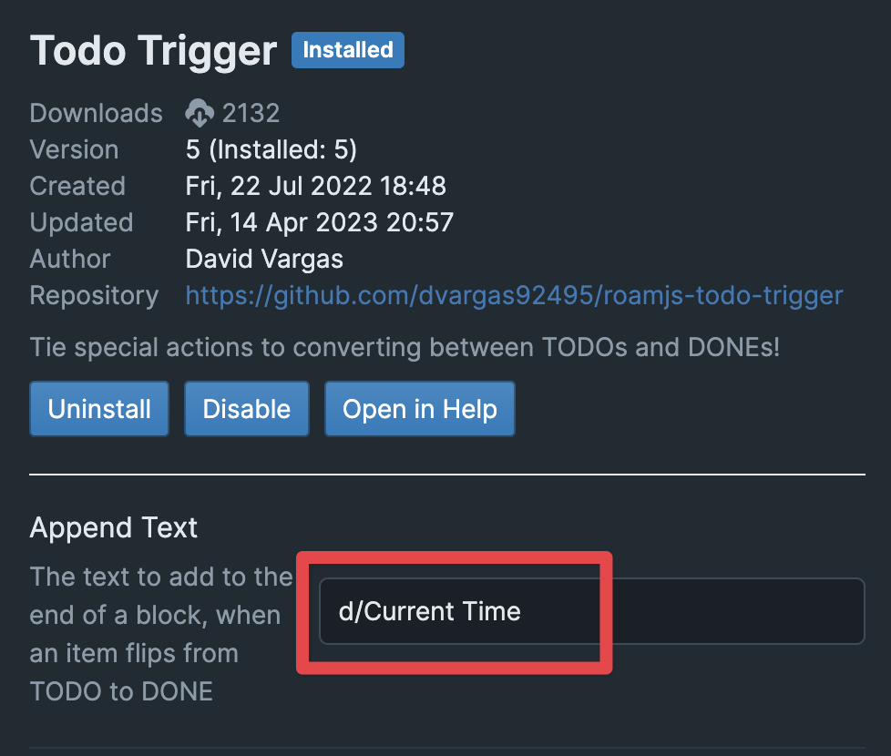

Nautilus is a Roam Research extension designed for effective, stress-free daily task planning. It shifts tasks and calendar events into a watch face-like visual system within the Roam interface, acknowledging that tasks vary in duration. Traditional time-boxing solution is be stressful due to rigid schedules; if one fails to keep up, the agenda quickly derails. Nautilus is more flexible, dynamically repositioning unfinished tasks within your day's remaining open time slots. This system reduce stress, improves prioritization, and clarifies feasible tasks at any given moment.

## General instructions

-	Tasks/events are managed as text lists, which Nautilus dynamically visualizes as watch-like visual timeline, based on real-time data.
-	A notable feature is the automatic task "push-forward," relocating uncompleted tasks within open time slots in your day.
-	Users write tasks in a very simple format:
    - **events** are rows containing a time range in 24h format (e.g., "12:30-13 Meeting with JK", "9-10 Breakfast")
    - **tasks** are rows the and are movable during a day (e.g., "{{[[TODO]]}} this important task (27min)").
-	Tasks default to a 15-minute time allocation, but this can be adjusted here in settings
-   The order of tasks in Nautilus watch reflects exactly the order of tasks in the list. 
-	Tasks can be forced to follow after a particular event – easy by placing them after the event; for example, setting a run post-lunch.
-	Once a task is marked 'DONE' in Roam, it's tagged with the completion time, which visually displays as a faint grey section on the snail.
-	Each morning, events are copied from the calendar, tasks are chosen from the backlog, given a length and order, and Nautilus arranges the rest.
-	The CalCopy plugin assists in transferring events from the iCal to Roam, converting iCal format to caldown.
-	While preparation might seem involved, it greatly aids in conscious day planning and eventual task optimization. Users can test Nautilus in Hackopedia in club Roam.

## Usage

### 1. Install TODO Trigger extension for better experience
I suggest to install David Vargas's TODO Trigger extension before using Nautilus and setting it to automatically add a timestamp when todo is done. 

### 2. Insert the component into your Daily Page
Easiest way to insert the component is though Roam's native template menu. Simply type `;;` and look for __EXTENSION NAME HERE__
</img>

### 3. Put your tasks and events into the children block 
- Just move a list of your todos there. 

## Example 

## Setup 
First make sure that __User code__ is enabled in your settings. This allows custom components in your graph.

</img>

